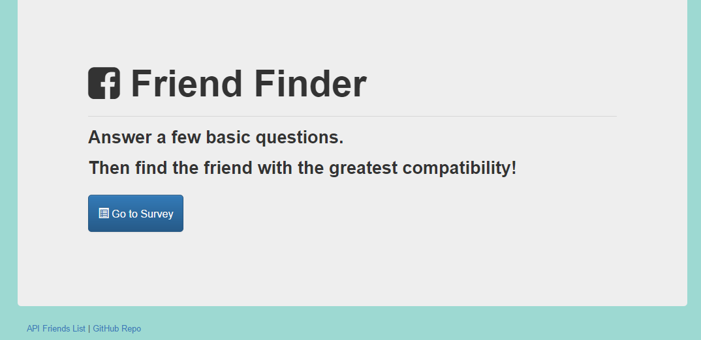

# FriendFinder

FriendFinder is an Express - Node.js web application to match friends based on 10 survery questions. This is an assignment for the UNCC Coding Boot Camp.

### Installing

 - Clone or download this repository to a folder on your local system. 
 - Node.js will need to be installed and running. In your terminal window, navigate to the new folder you created.
 - In your terminal window, run 'npm install'.

All supporting packages (express & body-parser) will be installed to you system.

## Starting the server & using the app

To start the server, run 'node server'.
In your browser window, navigate to 'localhost:3000'. If everything is installed correctly and the server is running, you should see this:

Click on the 'Go to Survey' button to get started. Have fun!

## Built With

* [Node.js](https://nodejs.org/en/) 
* [Express](https://expressjs.com/) 

## Author

* **Dan Phillips** - [dlphillips](https://github.com/dlphillips)

